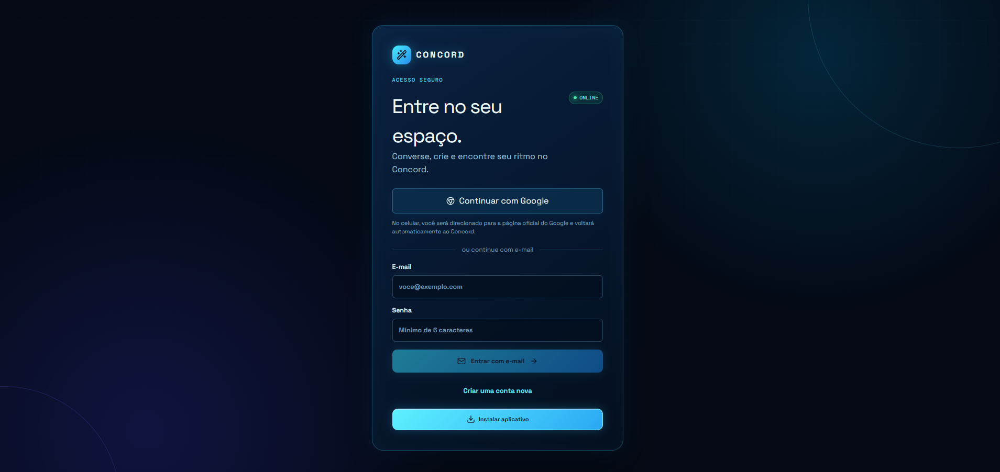
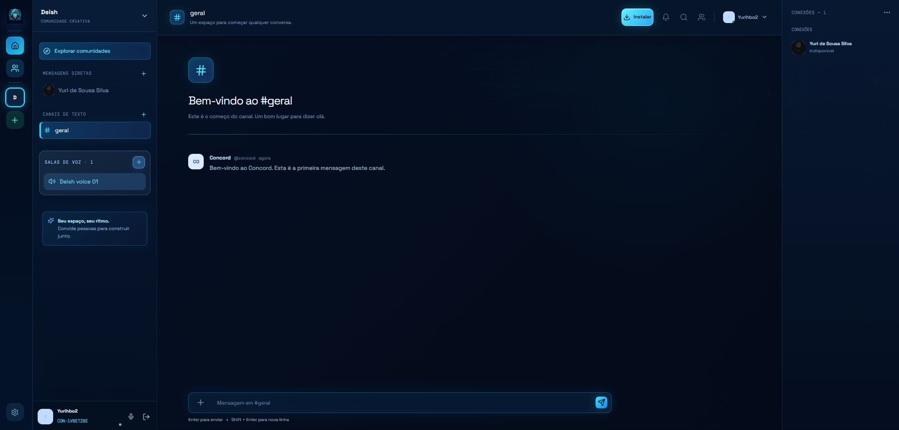
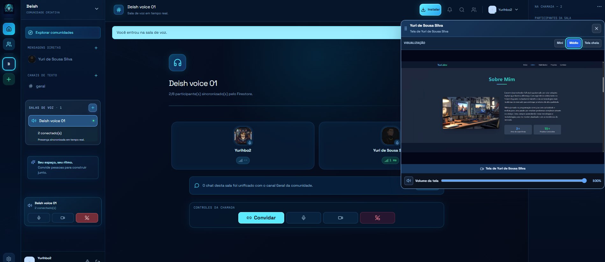

<div align="center">

# CONCORD

### ✦ Comunicação livre, comunidades e colaboração em tempo real.

Uma plataforma de comunicação web/PWA criada para reunir **comunidades, canais, mensagens diretas, chamadas de voz e compartilhamento de tela** em uma única experiência.

<br>

[](https://github.com/Yurihbo/concord)
[](https://react.dev/)
[](https://www.typescriptlang.org/)
[](https://vite.dev/)
[](https://tailwindcss.com/)
[](https://firebase.google.com/)
[](https://developer.mozilla.org/en-US/docs/Web/Progressive_web_apps)
[](LICENSE)

<br>

**[▸ Abrir o repositório](https://github.com/Yurihbo/concord)**

</div>

---

## ✦ Sobre o Concord

O **Concord** é um projeto de comunicação livre desenvolvido como uma aplicação web progressiva, com foco em comunidades, conversas em tempo real e colaboração.

A proposta é reunir em uma única plataforma:

- comunidades;
- canais de texto;
- mensagens diretas;
- amizades e conexões;
- salas de voz;
- chamadas em tempo real;
- compartilhamento de tela;
- visualização da tela compartilhada;
- autenticação;
- instalação como aplicativo PWA.

A interface segue uma estética **dark/cyber**, com azul profundo, ciano, brilhos sutis e painéis tecnológicos.

---

## 🖼️ Interface

<div align="center">

### 🔐 Acesso



<br><br>

### 💬 Comunidade e canais



<br><br>

### 🎥 Sala de voz e compartilhamento de tela



</div>

---

## ⚡ Principais recursos

### 🔐 Autenticação

- Login com Google
- Login por e-mail e senha
- Criação de conta
- Integração preparada com Firebase Authentication

### 🌐 Comunidades

Espaços próprios para reunir pessoas, canais e salas de voz.

### #️⃣ Canais de texto

Conversas organizadas por canais, com navegação lateral e composição de mensagens.

### 💬 Mensagens diretas

Área dedicada a conversas individuais e conexões entre usuários.

### 🎙️ Salas de voz

- Entrada e saída de chamadas
- Participantes conectados
- Microfone
- Câmera
- Silenciamento
- Convites
- Estado de conexão

### 🖥️ Compartilhamento de tela

Um dos principais diferenciais do Concord:

- transmissão da tela;
- visualização da tela de outro participante;
- janela de visualização;
- controle de tamanho;
- controle de volume;
- identificação do participante;
- integração com a sala de voz.

### 👥 Participantes

Cartões de participantes com avatar, nome, estado de conexão, áudio e informações da chamada.

### 📲 PWA

O projeto possui `manifest.json` e `sw.js`, além de assets próprios e estrutura preparada para instalação como aplicativo.

---

## 🧱 Arquitetura

```text
CONCORD/
│
├── client/
│   ├── public/
│   │   ├── assets/
│   │   ├── manifest.json
│   │   ├── sw.js
│   │   └── concord-cyberpunk-bg.jpg
│   │
│   └── src/
│       ├── _core/
│       ├── components/
│       ├── contexts/
│       ├── hooks/
│       ├── lib/
│       ├── pages/
│       ├── services/
│       ├── App.tsx
│       └── main.tsx
│
├── server/
│   ├── _core/
│   ├── accounts.calls.test.ts
│   ├── auth.logout.test.ts
│   ├── calls.preview.test.ts
│   ├── concord.features.test.ts
│   ├── db.ts
│   ├── firebase.config.test.ts
│   ├── routers.ts
│   ├── storage.ts
│   └── voice.rooms.test.ts
│
├── firebase/
├── drizzle/
├── cypress/
├── docs/
├── shared/
├── patches/
├── package.json
├── pnpm-lock.yaml
├── vite.config.ts
└── tsconfig.json
```

O repositório atualmente separa `client`, `server`, `firebase`, `drizzle`, `cypress`, `docs` e `shared`.

---

## 🧩 Stack tecnológica

| Tecnologia | Função |
|---|---|
| **React 19** | Interface |
| **TypeScript 5.9** | Tipagem |
| **Vite 7** | Build e desenvolvimento |
| **Tailwind CSS 4** | Estilização |
| **Radix UI** | Componentes |
| **Lucide React** | Ícones |
| **Framer Motion** | Animações |
| **Wouter** | Roteamento |
| **React Hook Form** | Formulários |
| **Zod** | Validação |
| **TanStack Query** | Dados e requisições |
| **Express** | Servidor |
| **tRPC** | Comunicação tipada |
| **Drizzle ORM** | Banco |
| **MySQL** | Persistência |
| **Firebase** | Autenticação e dados |
| **Cypress** | Testes E2E |
| **Vitest** | Testes |

---

## 🔥 Firebase

O projeto possui uma camada própria:

```text
firebase/
├── README.md
├── firestore.indexes.json
├── firestore.rules
├── migration-plan.md
└── storage.rules
```

Variáveis utilizadas pelo Web App:

```env
VITE_FIREBASE_API_KEY=
VITE_FIREBASE_AUTH_DOMAIN=
VITE_FIREBASE_PROJECT_ID=
VITE_FIREBASE_STORAGE_BUCKET=
VITE_FIREBASE_MESSAGING_SENDER_ID=
VITE_FIREBASE_APP_ID=
VITE_FIREBASE_MEASUREMENT_ID=
```

> Nunca publique credenciais administrativas, service accounts, `private_key` ou tokens administrativos.

---

## 🚀 Executando localmente

### Pré-requisitos

- Node.js
- pnpm 10+
- Git
- configuração Firebase para os recursos utilizados

### 1. Clone

```bash
git clone https://github.com/Yurihbo/concord.git
cd concord
```

### 2. Instale

```bash
pnpm install
```

### 3. Configure o ambiente

Preencha as variáveis Firebase no arquivo de ambiente local.

### 4. Execute

```bash
pnpm dev
```

---

## 📦 Scripts

```bash
pnpm dev          # Desenvolvimento
pnpm build        # Build
pnpm build:pages  # Build para GitHub Pages
pnpm preview:pages
pnpm start        # Produção
pnpm check        # TypeScript
pnpm format       # Prettier
pnpm test         # Vitest
pnpm test:e2e     # Cypress
pnpm db:push      # Drizzle
```

---

## 🧪 Testes

O projeto possui testes unitários e E2E.

Existem cenários relacionados a:

- autenticação;
- chamadas;
- preview de chamadas;
- funcionalidades do Concord;
- configuração Firebase;
- salas de voz.

Execute:

```bash
pnpm test
```

ou:

```bash
pnpm test:e2e
```

---

## 🌍 GitHub Pages

O projeto possui build específico para publicação:

```bash
pnpm build:pages
```

A configuração atual documenta o uso do GitHub Pages com base `/concord/`.

---

## 🎨 Identidade visual

A identidade do Concord combina:

- 🌌 Azul-marinho profundo
- ⚡ Ciano neon
- 💠 Bordas luminosas
- 🖥️ Painéis escuros
- 🔵 Estados de conexão
- 🎙️ Controles de chamada
- ✦ Elementos tecnológicos
- 📱 Interface responsiva

A intenção é criar um **espaço digital próprio**, em vez de apenas reproduzir outra plataforma.

---

## 🧠 Conceito

> **"Converse. Conecte-se. Compartilhe. Construa seu espaço."**

O Concord nasceu da ideia de combinar:

**comunidade + mensagens + voz + compartilhamento de tela + PWA**

em um único projeto.

---

## 🛠️ Estado atual

O Concord está em **desenvolvimento contínuo**.

A base já contempla interface, autenticação, comunidades, canais, chamadas e PWA, enquanto a camada de dados/produção continua em evolução.

### Próximos caminhos

- [ ] Concluir migração para Firestore
- [ ] Evoluir sincronização em tempo real
- [ ] Ampliar sistema de amizades
- [ ] Expandir comunidades e permissões
- [ ] Melhorar chamadas
- [ ] Evoluir compartilhamento de tela
- [ ] Aprimorar notificações
- [ ] Expandir arquivos e mídia
- [ ] Melhorar experiência mobile
- [ ] Ampliar cobertura de testes

---

## 🔐 Segurança

O projeto possui regras específicas para Firestore e Storage.

Para uma implantação pública, revise:

- autenticação;
- autorização;
- regras do Firestore;
- regras do Storage;
- variáveis de ambiente;
- permissões de comunidade;
- acesso a chamadas;
- compartilhamento de arquivos;
- proteção contra abuso.

---

## 🤝 Contribuição

```bash
git checkout -b feature/minha-melhoria
git add .
git commit -m "feat: minha melhoria"
git push origin feature/minha-melhoria
```

Depois, abra um Pull Request descrevendo as alterações e como testar.

---

## 📁 Screenshots deste README

Como o repositório **já possui uma pasta `docs/`**, não substitua essa pasta.

Adicione apenas:

```text
docs/
└── screenshots/
    ├── login.png
    ├── workspace.png
    └── voice-screen-share.png
```

---

## 📜 Licença

O projeto declara licença **MIT**.

Consulte o arquivo `LICENSE` para os termos completos.

---

<div align="center">

## ✦ CONCORD

### Seu espaço. Seu ritmo. Sua comunidade.

<br>

Desenvolvido por **Yurihbo**

[GitHub](https://github.com/Yurihbo) · [Repositório Concord](https://github.com/Yurihbo/concord)

<br><br>

**Comunicação livre • Comunidades • Voz • Compartilhamento de tela • PWA**

</div>
